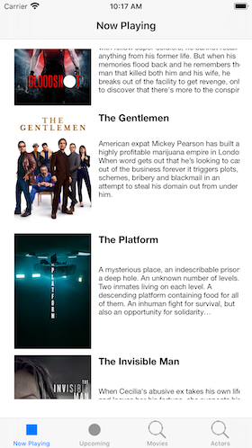
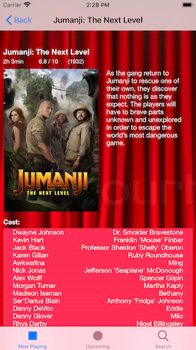
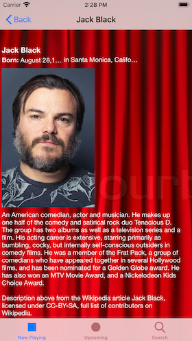

# MovieDB

MovieDB is an iOS app written in Swift that uses movie information from TMDb to show information about movies now playing and upcoming. As well as doing a search on a particular movie. And from the list of actors in the cast you can also select and view info about an actor.

The app uses UITabViewControllers and asynchronous file downloading to present the movie information and images. And uses the Coordinator pattern for navigation control.

It has been updated to iOS 15 using async/await for network calls. Very clean way of doing this.

It has also been updated to use dependency injection for data source. The implementation is Singleton-type using PropertyWrappers. Very nice and modern Swift.

<img src="Screenshot-Search.png"

## License

MovidDB is licensed under the Unlicense. See the LICENSE file for more information, but basically this is sample code and you can do whatever you want with it.