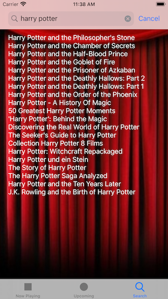

# MovieDB

MovieDB is an iOS app written in Swift that uses movie information from TMDb to show information about movies now playing and upcoming. As well as doing a search on a particular movie. And from the list of actors in the cast you can also select and view info about an actor. The app uses UITabViewControllers and asynchronous file downloading to present the movie information and images. 

| 

|

|

|

## License

MovidDB is licensed under the MIT License. See the LICENSE file for more information, but basically this is sample code and you can do whatever you want with it.